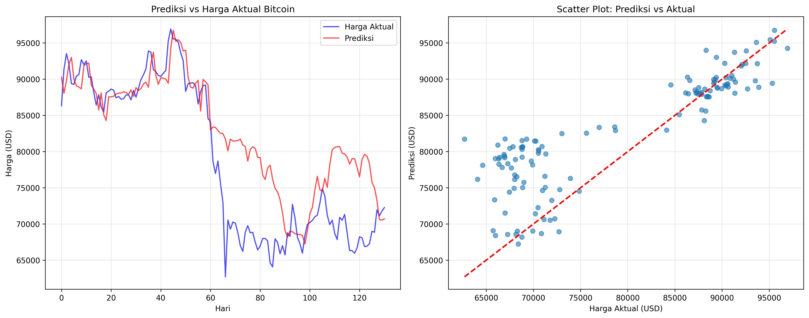
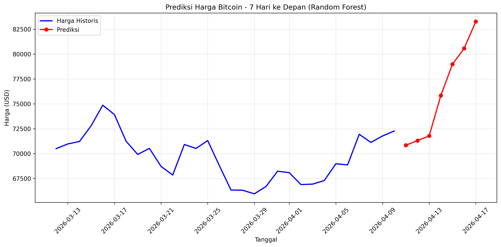

# Bitcoin Predictor

Sistem prediksi harga Bitcoin menggunakan machine learning dengan dukungan LSTM dan Random Forest.

## Fitur

- **Dual Model Support**: LSTM (jika TensorFlow tersedia) atau Random Forest sebagai fallback
- **Data Real-time**: Mengambil data Bitcoin terbaru dari Yahoo Finance
- **Indikator Teknikal**: Moving Average, RSI, dan Volatility
- **Evaluasi Komprehensif**: MSE, RMSE, MAE, MAPE
- **Visualisasi**: Grafik perbandingan dan prediksi masa depan
- **Prediksi**: Estimasi harga 7 hari ke depan

## Instalasi

```bash
pip install -r requirements.txt
```

## Penggunaan

```bash
python main.py
```

## Hasil Visualisasi

### Evaluasi Model


Grafik evaluasi model menunjukkan:
- **Grafik Kiri**: Perbandingan prediksi (merah) vs harga aktual (biru)
- **Grafik Kanan**: Scatter plot untuk melihat akurasi prediksi

### Prediksi Masa Depan


Grafik prediksi 7 hari ke depan berdasarkan data historis dan model yang telah dilatih.

## Output Files

- `bitcoinPredictionResults.png`: Grafik evaluasi model
- `bitcoinFuturePrediction.png`: Grafik prediksi masa depan
- `bitcoinPredictions.csv`: Hasil prediksi dalam format CSV

## Contoh Output Console

```
=== EVALUASI MODEL ===
Mean Squared Error (MSE): $12,345,678.90
Root Mean Squared Error (RMSE): $3,514.21
Mean Absolute Error (MAE): $2,156.78
Mean Absolute Percentage Error (MAPE): 5.23%

=== PREDIKSI 7 HARI KE DEPAN ===
2024-04-11: $67,234.56
2024-04-12: $68,123.45
2024-04-13: $67,890.12
...

=== RINGKASAN ===
Model: Random Forest
Model RMSE: $3,514.21
Model MAPE: 5.23%
Harga saat ini: $67,000.00
Prediksi 1 hari: $67,234.56
Prediksi 7 hari: $68,500.00
Perubahan prediksi 1 hari: +0.35%
Perubahan prediksi 7 hari: +2.24%
```

## Catatan

⚠️ **Disclaimer**: Model ini untuk tujuan edukasi. Cryptocurrency sangat volatile - gunakan dengan bijak untuk keputusan investasi.